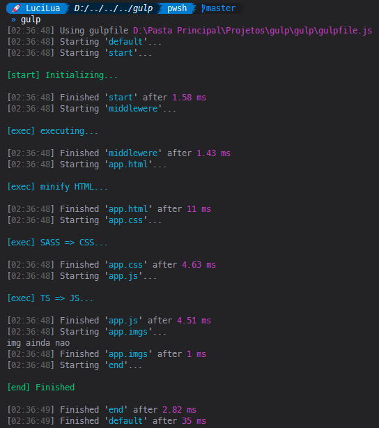

# <p align="center">📚 Gulp 📚</p>

<p align="center">gulp: HTML minify, SASS to CSS, TS to JS</p>

<h1 align="center">

  

## 🛠 Technologies used

     

## 🚀 How to start

To contribute to this project or learn from it is very simple, just clone this repository on your computer and install the necessary dependencies for it to work. Below you can check how to do this.

### 📌 Requirement

> node package manager (NPM or YARN)

> Git bash (optional, you can download the code directly from GitHub at 'code' > 'Download zip')

> Gulp (npm -g gulp)

### ✨ Now are you ready to start

> clone the repository

```bash
git clone https://github.com/LuciLua/gulp.git
```

> open project folder

```bash
cd ./gulp
```

> install all packages using npm or yarn manager (using YARN)

```bash
yarn
```

> Run

```bash
gulp
```

### 🖼️ Preview

<p align="center">
    
</p>
